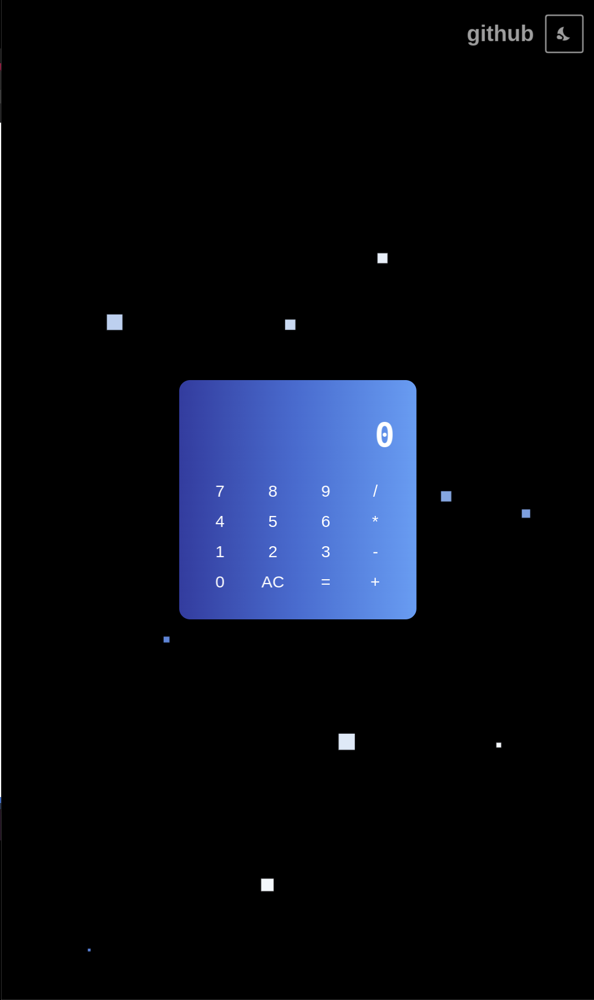

# It's a calculator.

I made this to learn Flutter again since the last time I used it, Flutter didn't even have version 1.0

You can see the app [here.](https://nicharoj.github.io/flutter_calculator) There might some delay as the page loads.

## Features:

- Math calculation using [expressions.](https://pub.dev/packages/expressions)
- Floating particles in the background.
- A button for changing background color.
- A button to open this github page using [url_launcher.](https://pub.dev/packages/url_launcher)

I don't know why you would, but please don't use my code in this project.
